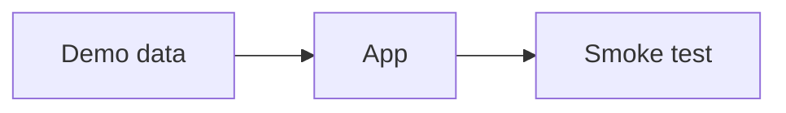

> [!IDEA] Big idea
Smoke tests open every page with this demo semester, so a broken build never reaches a release.

## How it fits together

```mermaid
flowchart LR
  A[Demo data] --> B[App] --> C[Smoke test]
```

## Math

The demo formula: $E = mc^2$.
